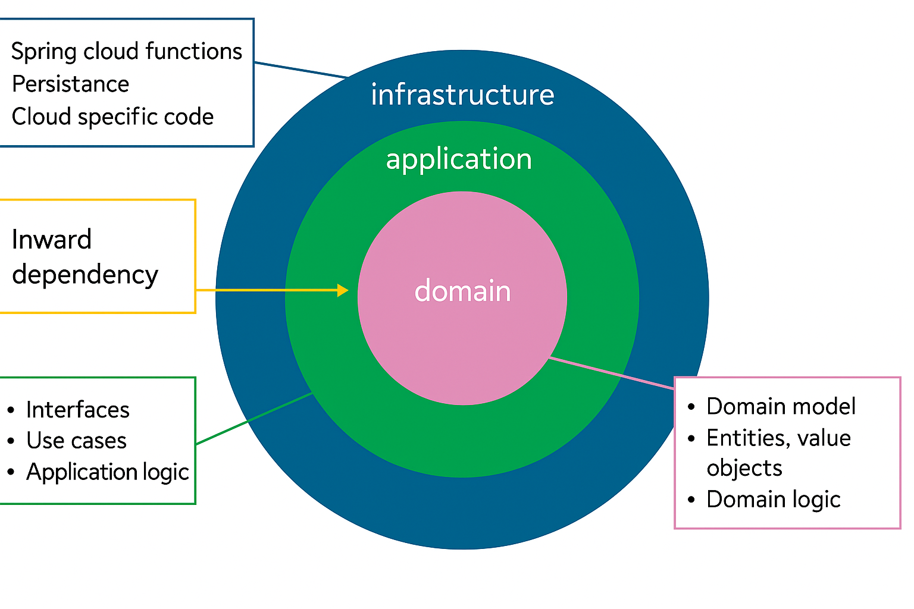
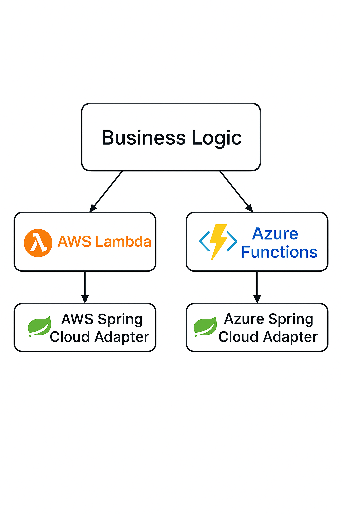
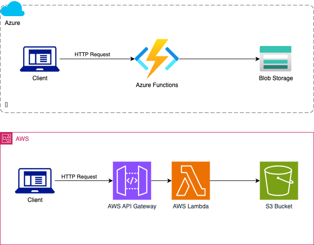

# Clean Architecture



For explanation, see:
* [**Live Coding Featuring This Imlementation @Voxxed Days Amsterdam (April 3, 2025)**](https://www.youtube.com/watch?v=wz0GQbkrr1Q)

# Project Structure

```
kotlin-spring-cloud-function-clean-architecture-demo/
│
├── build.gradle.kts     // Root build file
├── settings.gradle.kts  // Contains include statements for subprojects
│
├── .github/             // GitHub-specific configuration
│   └── workflows/       // GitHub Actions workflow definitions
│       ├── feature-aws.yml                  // Triggers AWS deployment for feature branches
│       ├── feature-azure.yml                // Triggers Azure deployment for feature branches
│       ├── main-aws.yml                     // Triggers AWS deployment for main branch
│       ├── main-azure.yml                   // Triggers Azure deployment for main branch
│       ├── workflow-build-deploy-aws.yml    // Reusable workflow for AWS Lambda build and deployment
│       └── workflow-build-deploy-azure.yml  // Reusable workflow for Azure Function build and deployment
│
├── software/            // Holds all the business logic and application code
│   ├── domain/
│   │   ├── src/
│   │   └── build.gradle.kts
│   ├── application/
│   │   ├── src/
│   │   └── build.gradle.kts
│   └── infra/            // Infrastructure specific code
│       ├── aws/          // AWS-specific code, including AWS Lambda
│       │   ├── src/
│       │   └── build.gradle.kts
│       └── azure/        // Azure-specific code, including Azure Function
│           ├── src/
│           └── build.gradle.kts
│
└── cdk/                  // Terraform CDK Kotlin code
    ├── aws/
    │   ├──src/
    │   ├──build.gradle.kts
    │   ├──cdktf.out/            // Generated by generateTerraform.sh
    │   ├──generated/            // Generated by generateTerraform.sh
    │   └──generateTerraform.sh  // Generates terraform json from CDK, run when infrastructure changes
    └── azure/
        ├──src/
        ├──build.gradle.kts
        ├──cdktf.out/            // Generated by generateTerraform.sh
        ├──generated/            // Generated by generateTerraform.sh
        └──generateTerraform.sh  // Generates terraform json from CDK, run when infrastructure changes

```

# Spring Cloud Function



For explanation, see:
* [**Live Coding Featuring This Imlementation @Voxxed Days Amsterdam (April 3, 2025)**](https://www.youtube.com/watch?v=wz0GQbkrr1Q)

# Solution Architecture


# Getting Started
## Prerequisites
Before you begin, ensure you have the following:

- **Java 21** or later installed
- Git for version control
- Gradle (the project uses the Gradle wrapper, so you don't need to install it separately)
- IDE of your choice (IntelliJ IDEA recommended for Kotlin development)

### Cloud Provider Requirements
This project can be deployed to either AWS or Azure or both. Depending on your target environment, you'll need:

#### AWS Account Requirements
- An AWS account with permissions to:
  - Create and manage Lambda functions
  - Create and manage API Gateway resources
  - Create and manage IAM roles and policies
  - Create and manage S3 buckets
  - Deploy AWS resources via Terraform

#### Azure Account Requirements
- An Azure account with permissions to:
  - Create and manage Azure Functions
  - Create and manage Storage accounts
  - Create and manage Application Insights
  - Assign roles to managed identities
  - Deploy Azure resources via Terraform

## Build Project
After checking out the project, ensure it can build properly by running:
```bash
./gradlew build
```
from the root of the project.

## Questions or Issues
If you have questions or encounter issues, please log them in the repository's issue tracker:
[https://github.com/elenavanengelenmaslova/kotlin-spring-cloud-function-clean-architecture-demo/issues](https://github.com/elenavanengelenmaslova/kotlin-spring-cloud-function-clean-architecture-demo/issues)

## Reference Documentation

For further reference, please consider the following sections:

* [**Live Coding Featuring This Imlementation @Voxxed Days Amsterdam (April 3, 2025)**](https://www.youtube.com/watch?v=wz0GQbkrr1Q): *Clean Architecture for Serverless: Business Logic You Can Take Anywhere*
* [Alternative Example of Clean Architecture for Serverless in Action](https://github.com/elenavanengelenmaslova/kotlin-clean-architecture-example-docs-flow)
* [OpenID Connect in AWS](https://docs.github.com/en/actions/security-for-github-actions/security-hardening-your-deployments/configuring-openid-connect-in-amazon-web-services)
* [OpenID Connect in Azure](https://docs.github.com/en/actions/security-for-github-actions/security-hardening-your-deployments/configuring-openid-connect-in-azure)
* [Official Gradle documentation](https://docs.gradle.org)
* [Spring Boot Gradle Plugin Reference Guide](https://docs.spring.io/spring-boot/docs/3.1.4/gradle-plugin/reference/html/)
* [Create an OCI image](https://docs.spring.io/spring-boot/docs/3.1.4/gradle-plugin/reference/html/#build-image)
* [Function](https://docs.spring.io/spring-cloud-function/docs/current/reference/html/spring-cloud-function.html)

### Additional Links

These additional references should also help you:

* [Gradle Build Scans – insights for your project's build](https://scans.gradle.com#gradle)
* [Various sample apps using Spring Cloud Function](https://github.com/spring-cloud/spring-cloud-function/tree/main/spring-cloud-function-samples)
