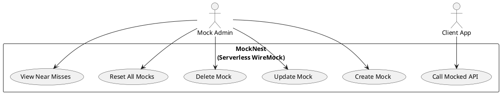
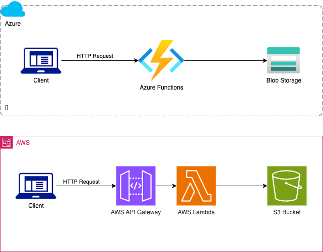

# Getting Started

## Use cases
_View with PlantUML IntelliJ plugin_


# Solution Architecture


## Project Structure

```
kotlin-spring-cloud-function-clean-architecture-example/
│
├── build.gradle.kts     // Root build file
├── settings.gradle.kts  // Contains include statements for subprojects
│
├── software/            // Holds all the business logic and application code
│   ├── domain/
│   │   ├── src/
│   │   └── build.gradle.kts
│   ├── application/
│   │   ├── src/
│   │   └── build.gradle.kts
│   └── infra/            // Infrastructure specific code
│       ├── aws/          // AWS-specific code, including AWS Lambda
│       │   ├── src/
│       │   └── build.gradle.kts
│       └── azure/        // Azure-specific code, including Azure Function
│           ├── src/
│           └── build.gradle.kts
│
└── cdk/                  // Terraform CDK Kotlin code
    ├── aws/
    │   ├──src/
    │   └──build.gradle.kts
    └── azure/
        ├──src/
        └──build.gradle.kts

```

### Reference Documentation

For further reference, please consider the following sections:

* [Official Gradle documentation](https://docs.gradle.org)
* [Spring Boot Gradle Plugin Reference Guide](https://docs.spring.io/spring-boot/docs/3.1.4/gradle-plugin/reference/html/)
* [Create an OCI image](https://docs.spring.io/spring-boot/docs/3.1.4/gradle-plugin/reference/html/#build-image)
* [Function](https://docs.spring.io/spring-cloud-function/docs/current/reference/html/spring-cloud-function.html)

### Additional Links

These additional references should also help you:

* [Gradle Build Scans – insights for your project's build](https://scans.gradle.com#gradle)
* [Various sample apps using Spring Cloud Function](https://github.com/spring-cloud/spring-cloud-function/tree/main/spring-cloud-function-samples)

